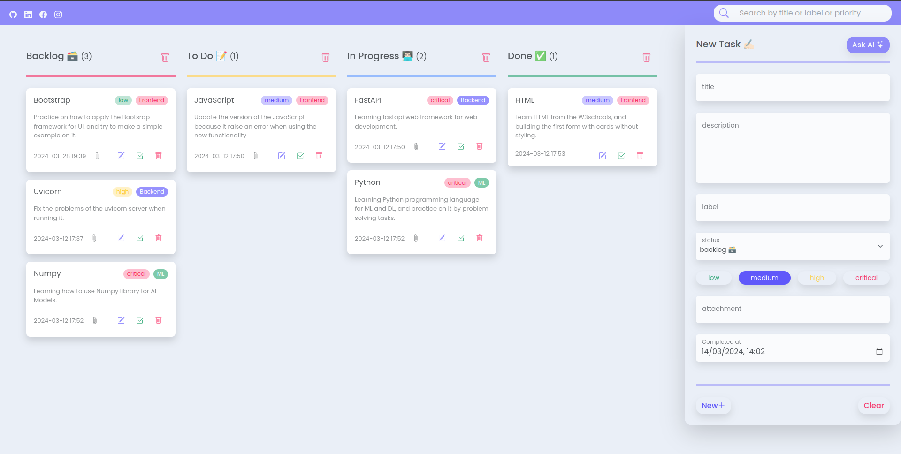

# TTL (Todo Task List) <a href="#" target="_blank"></a>

What's your plan today? 🤔




## Overview

Welcome to my humble **full-stack** project 👋

**TTL** is simulating a **todo task list** manager application, combined with an **AI Assistant** ✨.

## Description

**TTL** Where simplicity meets innovation ⚡! Seamlessly combining the efficiency of a traditional task manager with the
intuitive support of an **AI Assistant** 💎, Our application strives to streamline your productivity journey. Whether
you're
juggling multiple projects, planning your day, or prioritizing your tasks, our user-friendly interface and intelligent
assistant are here to support you every step of the way. Let us help you stay organized, focused, and empowered to
manage all your tasks with ease. Welcome aboard **TTL** 🤗!

**Note**: When using the project, you will directly write your task; there is no Sign in/up yet 🫣.

## Goal

The primary aim of **TTL** 🪄 is to enhance my technical and development skills by applying the technologies and tools
I've
learned. It serves as a journey of learning, starting from building a project from scratch to deployment, traversing
through all development stages 🎖️.

## Technologies

Technologies & Tools 🚀 used in **TTL**:

<br/>
<a href="https://www.python.org" target="_blank"></a>
<a href="https://fastapi.tiangolo.com" target="_blank"></a>
<a href="https://www.postgresql.org" target="_blank"></a>
<a href="https://www.docker.com" target="_blank"></a>
<a href="https://python-poetry.org" target="_blank"></a>
<a href="https://docs.pytest.org/en/8.0.x/contents.html" target="_blank"></a>
<a href="https://getbootstrap.com/docs/5.3/getting-started/introduction" target="_blank"></a>
<a href="https://developer.mozilla.org/en-US/docs/Web/HTML" target="_blank"></a>
<a href="https://developer.mozilla.org/en-US/docs/Web/JavaScript" target="_blank"></a>
<a href="https://developer.mozilla.org/en-US/docs/Web/CSS" target="_blank"></a>

## Installation

Here are the steps you must follow to install **TTL** correctly 🎯:

1. Clone the project

```zsh
git clone https://github.com/IsmaelMousa/todo-task-list.git
```

2. Navigate to the project

```zsh
cd todo-task-list
```

3. Setup virtual environment

```zsh
python3 -m venv .venv
```

4. Activate the virtual environment

```zsh
source .venv/bin/activate
```

5. Install the required dependencies

```zsh
make install
```

## Modules

After completing the installation steps ✅, the project files should be like this when you open **TTL**:

```zsh
todo-task-list
 ├── .github
 │   ├── workflows
 │   │   └── ci.yml
 │   └── website.png
 ├── .venv 
 │   ├── bin
 │   ├── include
 │   ├── lib
 │   ├── .gitignore
 │   └── pyvenv.cfg
 ├── dependencies 
 │   ├── __init__.py
 │   └── util.py
 ├── errors
 │   ├── __init__.py
 │   └── custom.py
 ├── infrastructures
 │   ├── crud
 │   │   ├── __init__.py
 │   │   └── task.py
 │   ├── __init__.py 
 │   └── database.py
 ├── models
 │   ├── __init__.py
 │   └── task.py
 ├── routers
 │   ├── __init__.py
 │   └── task.py
 ├── schemas
 │   ├── __init__.py
 │   └── task.py 
 ├── tests
 │   ├── __init__.py
 │   ├── dependencies_util.py
 │   ├── infrastructures_crud_task.py
 │   ├── infrastructures_database.py
 │   ├── models_task.py
 │   ├── routers_task.py
 │   ├── schemas_task.py
 │   ├── utils_config.py
 │   └── utils_logger.py    
 ├── utils
 │   ├── __init__.py
 │   ├── config.py
 │   └── logger.py
 ├── views
 │   ├── images
 │   │   └── website-icon.png
 │   ├── index.html
 │   ├── index.js
 │   └── style.css     
 ├── .gitignore
 ├── config.yml
 ├── main.py
 ├── Makefile
 ├── poetry.lock
 ├── pyproject.toml
 └── README.md
```

<br/>

Here is a summary 📝 for the purpose of each major module or component in **TTL**:

|      Module       | Description                                                                                              |
|:-----------------:|:---------------------------------------------------------------------------------------------------------|
| `infrastructures` | Manages database-related elements, including preparation, maintenance, and operations.                   |
|     `main.py`     | Serves as the entry point, initiating the application.                                                   |
|   `config.yml`    | Contains main configurations such as database settings, ...etc.                                          |
|     `models`      | Defines the schemas of the database tables/entities.                                                     |
|     `schemas`     | Defines the schemas of the Pydantic models used in the application.                                      |
|     `routers`     | Manages and creates the application's routers/endpoints.                                                 |
|      `utils`      | Houses common utilities/logic utilized throughout the application, including logging mechanisms, ...etc. |
|     `errors`      | Prepares and customizes exceptions for handling specific issues.                                         |
|      `tests`      | Handles the preparation and execution of unit tests.                                                     |
|  `dependencies`   | Manages and creates dependencies utilized for various operations within the application.                 |
|      `views`      | Represents the user interface (UI) files, or can say front-end side.                                     |

## Usage

Here is how to use the **TTL** 💁‍♂️:

1.

```
make run
```

2. Navigate to: [http://localhost:8000/ttl/index.html](http://localhost:8000/ttl/index.html) 😀